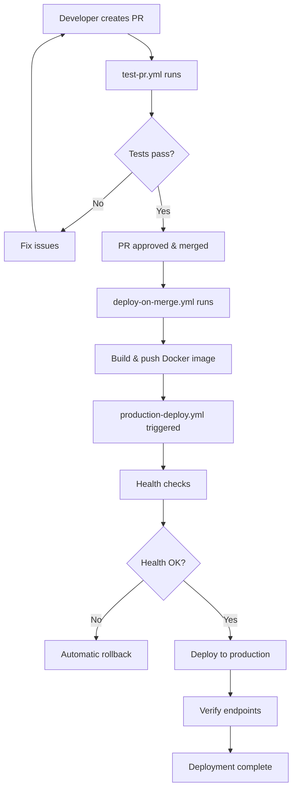

# GitHub Actions Workflows

This directory contains automated CI/CD workflows for the FastAPI backend application.

## Workflows Overview

### 1. `test-pr.yml` - Pull Request Testing
**Trigger:** On pull request creation, updates, and reopening
**Purpose:** Comprehensive testing before code is merged

**Features:**
- ✅ Multi-Python version testing (3.11, 3.12)
- ✅ Unit tests with pytest
- ✅ Code coverage reporting
- ✅ Docker build testing
- ✅ Security scanning with Trivy
- ✅ Automatic PR comments with coverage reports
- ✅ Code linting with flake8

### 2. `deploy-on-merge.yml` - Automatic Deployment on PR Merge
**Trigger:** When a pull request is merged into main branch
**Purpose:** Immediate deployment after successful merge

**Features:**
- ✅ Runs only on successful PR merges
- ✅ Pre-deployment testing and coverage checks
- ✅ Multi-platform Docker image building
- ✅ Automatic deployment status tracking
- ✅ PR comments with deployment status
- ✅ Failure notifications

### 3. `production-deploy.yml` - Production Deployment
**Trigger:** After successful merge deployment OR manual trigger
**Purpose:** Deploy to production server with health checks

**Features:**
- ✅ Health checks before deployment
- ✅ Zero-downtime deployment strategy
- ✅ Endpoint testing after deployment
- ✅ Automatic rollback on failure
- ✅ Resource limits and restart policies
- ✅ Old image cleanup

### 4. `docker-image.yml` - Docker Image CI (Enhanced)
**Trigger:** Push to main branch OR manual trigger
**Purpose:** Build and push Docker images

**Features:**
- ✅ Multi-platform builds (AMD64, ARM64)
- ✅ Proper image tagging with metadata
- ✅ Build caching for faster builds
- ✅ Docker Hub integration

### 5. `docker-host.yml` - Legacy CD Pipeline
**Trigger:** After Docker Image CI completion
**Purpose:** Deploy to self-hosted runner (legacy)

**Note:** This workflow is maintained for backward compatibility but the new `production-deploy.yml` is recommended.

## Deployment Flow



## Required Secrets

Configure these secrets in your GitHub repository settings:

### Docker Hub
- `DOCKER_USERNAME` - Your Docker Hub username
- `DOCKER_PASSWORD` - Your Docker Hub password or access token

### Optional (for enhanced features)
- `CODECOV_TOKEN` - For coverage reporting (optional)
- `SLACK_WEBHOOK` - For Slack notifications (if implemented)

## Self-Hosted Runner Setup

For the production deployment to work, you need a self-hosted runner with:

1. **Docker installed and running**
   ```bash
   sudo systemctl enable docker
   sudo systemctl start docker
   ```

2. **Runner user in docker group**
   ```bash
   sudo usermod -aG docker $USER
   ```

3. **Required ports open**
   - Port 8000 for the FastAPI application
   - Port 8001 for health checks (temporary)

## Manual Deployment

You can manually trigger deployments using GitHub's workflow dispatch:

1. Go to **Actions** tab in your repository
2. Select **Production Deployment** workflow
3. Click **Run workflow**
4. Optionally specify a Docker image tag

## Monitoring and Troubleshooting

### Deployment Status
- Check the **Deployments** section in your repository
- Monitor workflow runs in the **Actions** tab
- Review PR comments for deployment status

### Common Issues

1. **Docker Hub Authentication Failed**
   - Verify `DOCKER_USERNAME` and `DOCKER_PASSWORD` secrets
   - Check if Docker Hub account has necessary permissions

2. **Self-Hosted Runner Offline**
   - Ensure the runner service is active
   - Check network connectivity
   - Verify runner registration

3. **Health Check Failures**
   - Review application logs: `sudo docker logs fastapi-backend-container`
   - Check if all dependencies are properly installed
   - Verify port availability

4. **Test Failures**
   - Review test logs in the Actions tab
   - Ensure all test dependencies are in requirements.txt
   - Check for environment-specific issues

### Rollback Procedure

If automatic rollback fails, manual rollback:

```bash
# On your production server
sudo docker stop fastapi-backend-container
sudo docker rm fastapi-backend-container

# Find previous working image
sudo docker images sakthi1946/fastapi-backend

# Run previous version
sudo docker run -d -p 8000:8000 --name fastapi-backend-container sakthi1946/fastapi-backend:PREVIOUS_TAG
```

## Customization

### Environment-Specific Configuration
Update the workflows to match your environment:

1. **Production URL**: Update `environment_url` in workflows
2. **Container Name**: Change `fastapi-backend-container` if needed
3. **Port Mapping**: Modify port configurations as required
4. **Resource Limits**: Adjust memory and CPU limits in production-deploy.yml

### Adding Notifications
You can extend the workflows to include:
- Slack notifications
- Email alerts
- Discord webhooks
- Custom monitoring integrations

### Security Enhancements
Consider adding:
- Image vulnerability scanning
- Secrets scanning
- SAST (Static Application Security Testing)
- Dependency vulnerability checks

## Best Practices

1. **Always test in staging first** before production deployment
2. **Monitor application metrics** after deployment
3. **Keep Docker images small** and secure
4. **Use specific image tags** for production (avoid `latest` in production)
5. **Implement proper logging** and monitoring
6. **Regular security updates** for base images and dependencies